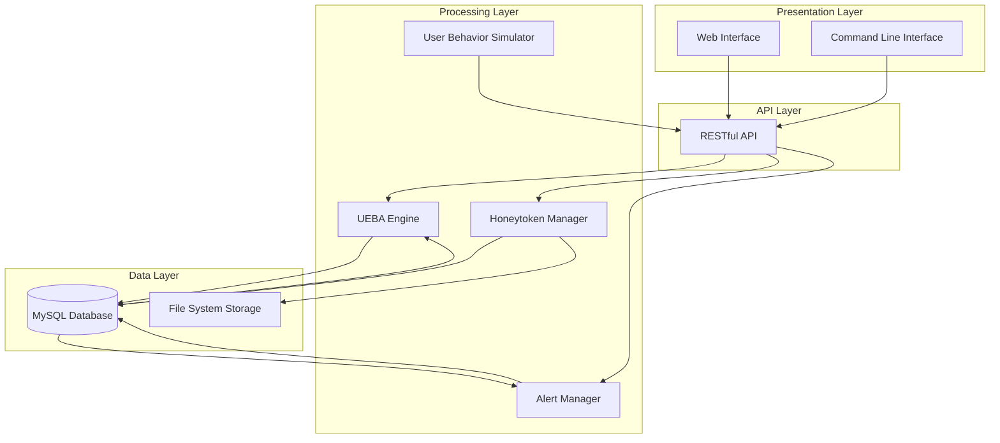
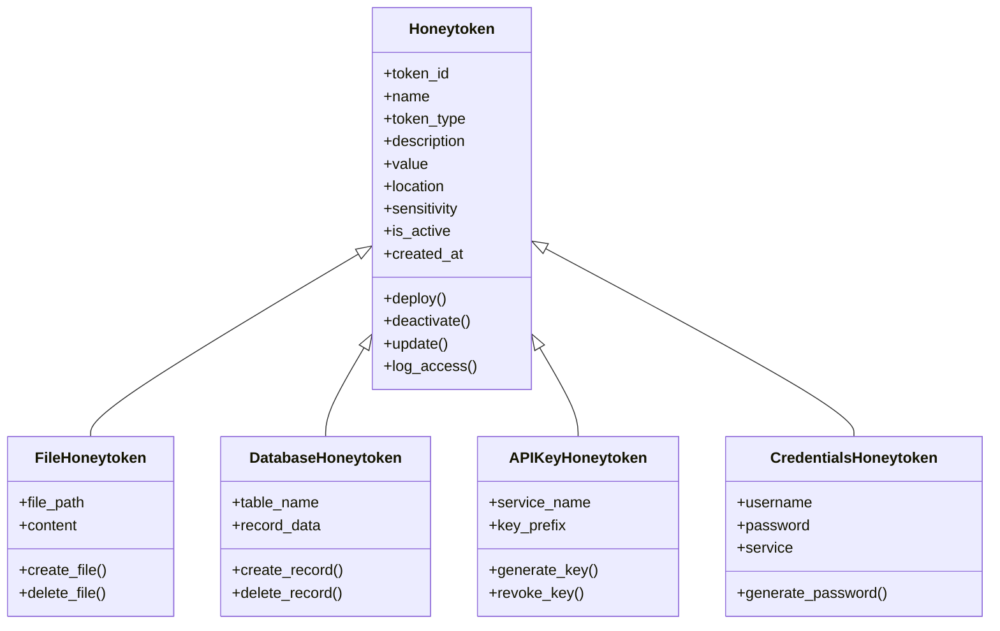
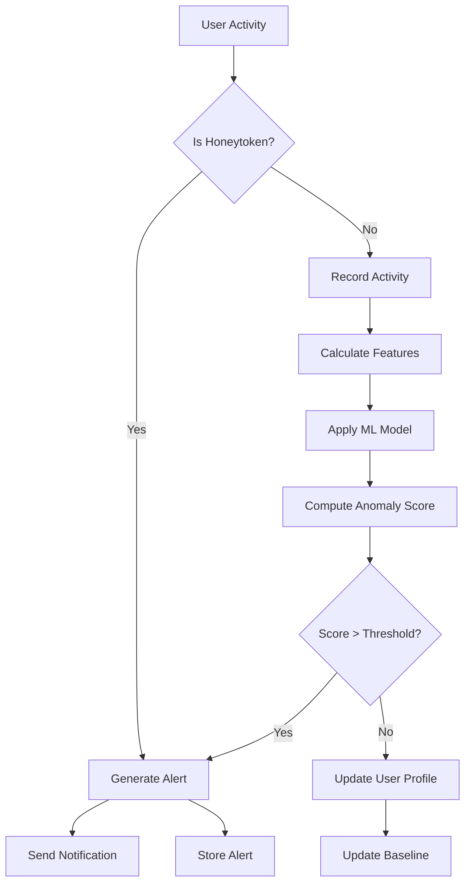
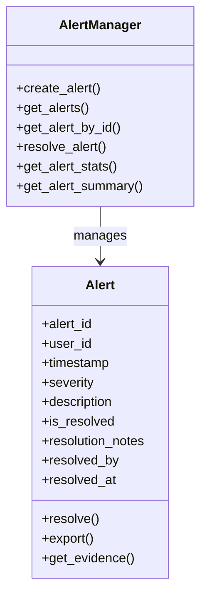
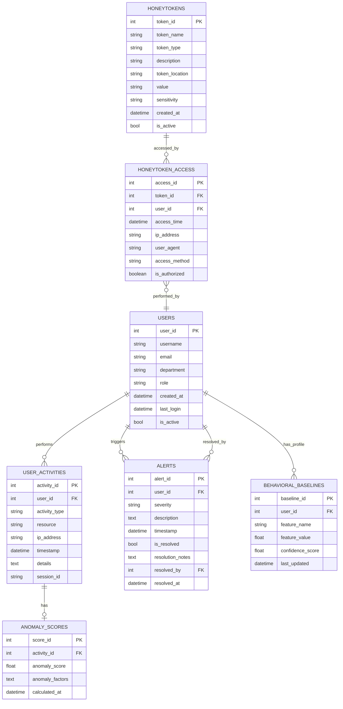
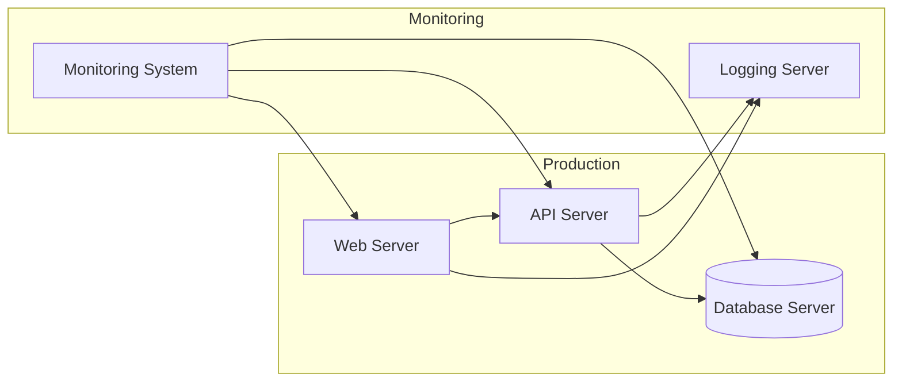

# UEBA Honeytoken System - Project Report

## 1. Executive Summary

The User and Entity Behavior Analytics (UEBA) Honeytoken System is a comprehensive security solution designed to detect and alert on suspicious activities related to honeytokens. The system combines the power of honeytokens (bait resources that should never be accessed legitimately) with behavior analytics to identify potential security breaches and insider threats. 

This project implements a complete web application with a modern UI that provides security teams with the ability to manage honeytokens, monitor user activities, analyze behavior patterns, and respond to security alerts in real-time. The system uses advanced machine learning techniques to establish baseline behavior patterns and detect anomalies that may indicate malicious activity.

## 2. Introduction

### 2.1 Background and Context

Organizations face increasing threats from both external attackers and malicious insiders. Traditional security measures often fail to detect sophisticated attacks, especially when legitimate credentials are compromised. Honeytokens provide a powerful mechanism to detect unauthorized access, while UEBA adds another layer of security by identifying abnormal behavior patterns.

### 2.2 Problem Statement

Security teams need efficient tools to:
- Deploy and monitor honeytokens across various systems
- Detect unauthorized access to honeytokens in real-time
- Analyze user behavior to identify potential threats
- Respond quickly to security incidents

### 2.3 Objectives

The UEBA Honeytoken System aims to:
1. Provide a centralized platform for honeytoken management
2. Detect and alert on unauthorized access to honeytokens
3. Monitor user behavior and identify anomalies
4. Facilitate quick investigation and response to security incidents
5. Generate comprehensive reports on security posture

## 3. Methodology

### 3.1 Design Approach

The system follows a modular and layered architecture:
1. **Data Layer**: MySQL database for storing honeytokens, user activities, alerts, and configuration
2. **Processing Layer**: Python backend for data processing, anomaly detection, and API services
3. **Presentation Layer**: Web-based UI with responsive design for administration and monitoring

### 3.2 Architecture



### 3.3 Technology Stack

- **Backend**: Python, Flask, MySQL Connector
- **Frontend**: HTML5, CSS3, JavaScript
- **Database**: MySQL
- **Data Visualization**: Chart.js
- **Development**: Git, Visual Studio Code
- **Deployment**: Docker (optional)

## 4. System Components

### 4.1 Honeytoken Management

The system supports multiple types of honeytokens with sophisticated deployment strategies:

#### 4.1.1 Honeytoken Types

- **File-based**: Decoy files with embedded tracking mechanisms
- **Database**: Fake records within databases 
- **API Keys**: False credentials for API access
- **Credentials**: Fake login credentials



#### 4.1.2 Trap Deployment Strategies

The system implements a sophisticated trap deployment methodology:

- **Strategic Placement**: Honeytokens are deployed in locations that legitimate users should never access but would be attractive to potential attackers. This includes:
  - Critical file directories with limited access permissions
  - Database tables with sensitive-looking names
  - Configuration files with apparent high privileges
  - Inactive but official-looking user accounts

- **Realistic Content**: Each honeytoken is generated with plausible but fake data to appear as legitimate sensitive information:
  - Documents labeled as "Confidential" or "Restricted"
  - Database records with realistic but fictional customer/financial data
  - Configuration entries that mimic production systems
  - Credentials that follow organization naming conventions

- **Access Controls**: Honeytokens are configured with appropriate permissions to make them discoverable while monitoring access:
  - File permissions that allow discovery but track access
  - Database triggers that log any SELECT operations
  - Authentication hooks that identify credential usage attempts

#### 4.1.3 Monitoring Mechanisms

- **Continuous Monitoring**: The system maintains real-time monitoring of all honeytoken access events through:
  - File system hooks and audit trails
  - Database access logs and triggers
  - Authentication system integration
  - Network traffic analysis for specific honeytoken markers

- **Contextual Analysis**: Each access is analyzed within the context of user behavior patterns:
  - Time of access compared to normal working hours
  - Location of access (network, IP address)
  - Prior behavior of the accessing entity
  - Sequence of actions before and after access

### 4.2 User Behavior Analytics

The UEBA component implements a multi-layered approach to analyzing user activities:

#### 4.2.1 Behavioral Baseline Establishment

- **Initial Learning Period**: The system observes users for 2-4 weeks to establish normal patterns
- **Feature Extraction**: Over 20 behavioral features are extracted, including:
  - Temporal patterns (time of day, day of week)
  - Resource access patterns (files, systems, applications)
  - Action types and frequencies (read, write, delete)
  - Session characteristics (duration, idle times, command sequences)
- **Dynamic Updates**: Baselines are continuously updated with weighted new observations to adapt to legitimate changes in behavior



#### 4.2.2 Anomaly Detection Methods

The system employs multiple complementary detection methods:

- **Statistical Analysis**: Z-score calculations for numerical features to identify outliers
- **Pattern Deviation**: Identification of unusual sequences or frequencies in activities
- **Time-Series Analysis**: Detection of temporal anomalies that deviate from historical patterns
- **Peer Group Comparison**: Behavior compared to similar role/department users for contextualized analysis
- **Weighted Scoring**: Different features weighted by reliability and security significance to improve accuracy

#### 4.2.3 Risk Scoring

Risk scores are calculated using sophisticated algorithms:

- **Cumulative Scoring**: Multiple small anomalies accumulate into significant risk scores over time
- **Decay Functions**: Risk scores naturally decrease over time if no continued anomalies are observed
- **Contextual Adjustment**: Scores are adjusted based on resource sensitivity and user role
- **Alert Threshold Customization**: Configurable thresholds by department or role to reduce false positives

### 4.3 Alert Management

Alerts are generated based on both direct honeytoken access and anomalous behavior:



### 4.4 Web Interface

The web interface provides dashboards and tools for:
- Dashboard with activity overview
- Honeytoken management
- Alert monitoring and response
- User activity analysis
- UEBA analytics and reporting

## 5. Implementation

### 5.1 Database Schema

The database includes the following key tables:



### 5.2 Core Algorithms

#### 5.2.1 Anomaly Detection Pseudocode

```
FUNCTION calculate_anomaly_score(user_id, activity):
    # Initialize score components
    score_components = {}
    
    # Get user's historical data
    user_profile = get_user_profile(user_id)
    
    # Check for IP address anomalies
    ip_score = calculate_ip_anomaly(user_profile, activity.ip_address)
    score_components["ip_address"] = ip_score
    
    # Check for time anomalies
    time_score = calculate_time_anomaly(user_profile, activity.timestamp)
    score_components["time_of_day"] = time_score
    
    # Check for resource access anomalies
    resource_score = calculate_resource_anomaly(user_profile, activity.resource)
    score_components["resource_access"] = resource_score
    
    # Check for activity type anomalies
    activity_score = calculate_activity_type_anomaly(user_profile, activity.activity_type)
    score_components["activity_type"] = activity_score
    
    # Check for sequence anomalies
    sequence_score = calculate_sequence_anomaly(user_profile, activity)
    score_components["activity_sequence"] = sequence_score
    
    # Calculate combined score
    weights = get_feature_weights()
    overall_score = 0
    
    FOR feature, score IN score_components:
        overall_score += score * weights[feature]
    
    # Normalize score between 0 and 1
    overall_score = min(1.0, overall_score)
    
    RETURN {
        "overall_score": overall_score,
        "components": score_components
    }

FUNCTION update_user_profile(user_id, activity, anomaly_score):
    user_profile = get_user_profile(user_id)
    
    # Update IP history
    update_ip_history(user_profile, activity.ip_address)
    
    # Update time patterns
    update_time_patterns(user_profile, activity.timestamp)
    
    # Update resource access patterns
    update_resource_patterns(user_profile, activity.resource)
    
    # Update activity type patterns
    update_activity_patterns(user_profile, activity.activity_type)
    
    # Update last activity
    user_profile.last_activity = activity
    
    # Save updated profile
    save_user_profile(user_id, user_profile)
```

#### 5.2.2 Behavioral Baseline Update Pseudocode

```
FUNCTION update_behavioral_baseline(user_id, feature_name, new_observation, weight=0.3):
    # Retrieve current baseline
    baseline = get_baseline(user_id, feature_name)
    
    IF baseline EXISTS:
        # Get current value and confidence
        current_value = baseline.feature_value
        confidence = baseline.confidence_score
        
        # Apply weighted average to update the baseline
        # Give more weight to established patterns (lower weight for new observation)
        updated_value = (current_value * (1 - weight)) + (new_observation * weight)
        
        # Increase confidence slightly with each update
        # Confidence approaches but never reaches 1.0
        updated_confidence = min(0.99, confidence + 0.01)
        
        # Update baseline in database
        update_baseline_in_db(
            user_id=user_id,
            feature_name=feature_name,
            feature_value=updated_value,
            confidence_score=updated_confidence,
            last_updated=current_timestamp()
        )
        
        RETURN updated_value, updated_confidence
    ELSE:
        # Create new baseline with moderate initial confidence
        initial_confidence = 0.5
        
        # Insert new baseline into database
        insert_baseline_in_db(
            user_id=user_id,
            feature_name=feature_name,
            feature_value=new_observation,
            confidence_score=initial_confidence,
            last_updated=current_timestamp()
        )
        
        RETURN new_observation, initial_confidence
```

#### 5.2.3 Alert Generation Pseudocode

```
FUNCTION process_activity(user_id, activity_type, ip_address, resource, details, user_agent, session_id):
    # Create activity record
    activity = {
        "user_id": user_id,
        "activity_type": activity_type,
        "ip_address": ip_address,
        "resource": resource,
        "details": details,
        "user_agent": user_agent,
        "session_id": session_id,
        "timestamp": current_timestamp()
    }
    
    # Save activity to database
    activity_id = save_activity(activity)
    
    # Check if this is honeytoken access
    is_honeytoken = check_honeytoken_access(resource)
    
    IF is_honeytoken:
        # Direct honeytoken access - high severity alert
        token = get_honeytoken_details(resource)
        generate_alert(
            user_id=user_id,
            severity="critical",
            description=f"Honeytoken access detected: {token.name}",
            evidence=activity
        )
        RETURN {"alert": "honeytoken_access", "severity": "critical"}
    
    # Calculate anomaly score
    analysis = calculate_anomaly_score(user_id, activity)
    
    # Save anomaly score
    save_anomaly_score(activity_id, analysis)
    
    # Update user profile with new activity
    update_user_profile(user_id, activity, analysis["overall_score"])
    
    # Check if score exceeds threshold for alert
    IF analysis["overall_score"] > get_alert_threshold():
        # Determine severity based on score
        severity = "low"
        IF analysis["overall_score"] > 0.7:
            severity = "high"
        ELSE IF analysis["overall_score"] > 0.4:
            severity = "medium"
        
        # Generate alert
        alert_id = generate_alert(
            user_id=user_id,
            severity=severity,
            description=f"Unusual behavior detected for user {user_id}:\nOverall anomaly score: {analysis['overall_score']:.2f}\n" + 
                      format_anomaly_factors(analysis["components"]),
            evidence=activity
        )
        
        RETURN {"alert": "anomaly_detected", "alert_id": alert_id, "severity": severity}
    
    RETURN {"analysis": analysis}
```

#### 5.2.4 Honeytoken Deployment Pseudocode

```
FUNCTION deploy_honeytoken(token_type, name, location, sensitivity="medium"):
    # Generate appropriate honeytoken based on type
    IF token_type == "file":
        # Create file honeytoken
        content = generate_realistic_file_content(sensitivity)
        honeytoken = create_file_honeytoken(name, content, location)
        
    ELSE IF token_type == "database":
        # Create database record honeytoken
        data = generate_realistic_database_record(sensitivity)
        table = determine_appropriate_table(sensitivity)
        honeytoken = create_database_honeytoken(name, data, table, location)
        
    ELSE IF token_type == "api_key":
        # Create API key honeytoken
        service = parse_service_from_location(location)
        key = generate_realistic_api_key(service)
        honeytoken = create_api_key_honeytoken(name, key, service, location)
        
    ELSE IF token_type == "credentials":
        # Create credentials honeytoken
        username = generate_username(name)
        password = generate_secure_password()
        service = parse_service_from_location(location)
        honeytoken = create_credentials_honeytoken(name, username, password, service, location)
    
    # Save honeytoken to database
    token_id = save_honeytoken(honeytoken)
    
    # Set up monitoring hooks based on token type
    setup_monitoring_hooks(token_id, token_type, location)
    
    # Add audit log entry
    log_audit_event(
        event_type="honeytoken_deployed",
        entity_type="honeytoken",
        entity_id=token_id,
        details=f"Deployed {token_type} honeytoken '{name}' at {location}"
    )
    
    RETURN token_id, honeytoken
```

### 5.3 API Endpoints

The system provides a comprehensive REST API:

```mermaid
graph TD
    A["API Root"] --> B["/api/honeytokens"]
    A --> C["/api/users"]
    A --> D["/api/alerts"]
    A --> E["/api/ueba"]
    A --> F["/api/activities"]
    
    B --> B1["GET - List all"]
    B --> B2["POST - Create new"]
    B --> B3["GET /:id - Get details"]
    B --> B4["PUT /:id - Update"]
    B --> B5["DELETE /:id - Delete"]
    B --> B6["POST /:id/access - Log access"]
    
    C --> C1["GET - List all"]
    C --> C2["GET /:id - Get details"]
    C --> C3["GET /:id/risk - Risk score"]
    C --> C4["GET /risky - Risky users"]
    C --> C5["GET /stats - User statistics"]
    
    D --> D1["GET - List all"]
    D --> D2["GET /recent - Recent alerts"]
    D --> D3["GET /summary - Alert summary"]
    D --> D4["GET /:id - Get details"]
    D --> D5["POST /:id/resolve - Resolve"]
    D --> D6["GET /:id/evidence - Evidence"]
    D --> D7["GET /:id/export - Export"]
    
    E --> E1["POST /activity - Log activity"]
    E --> E2["GET /activities/:user_id - User activities"]
    
    F --> F1["GET - Get activities"]
    F --> F2["GET /stats - Activity statistics"]
    F --> F3["GET /distribution - Anomaly distribution"]
```



## 6. Testing and Validation

### 6.1 Testing Approach

The system was tested using a multi-layered approach:
1. **Unit Testing**: Individual components and functions
2. **Integration Testing**: API endpoints and component interactions
3. **System Testing**: End-to-end workflows and use cases
4. **User Interface Testing**: Frontend functionality and usability

### 6.2 Test Scenarios

Key test scenarios included:
- Honeytoken creation, deployment, and management
- Detection of honeytoken access
- User activity monitoring and logging
- Anomaly detection and alert generation
- Alert management and resolution
- Dashboard and reporting functionality

### 6.3 Results

The system successfully passed all critical test scenarios. Minor issues were identified in the activity statistics API endpoint and anomaly distribution data, which will be addressed in future updates.

## 7. Deployment

### 7.1 Deployment Architecture



### 7.2 Installation Prerequisites

- Python 3.8+
- MySQL 8.0+
- Web server (Nginx/Apache)
- Modern web browser for UI access

### 7.3 Deployment Process

1. Database setup
2. Backend installation and configuration
3. Frontend deployment
4. System initialization (honeytokens, users, baseline data)
5. Integration with existing security systems (optional)

## 8. User Guide

### 8.1 Dashboard

The dashboard provides an overview of the system status, including:
- Active honeytokens
- Recent alerts by severity
- Top risky users
- Activity timeline

### 8.2 Honeytokens Management

The honeytokens page allows users to:
- View all deployed honeytokens
- Create new honeytokens
- Edit honeytoken details
- Delete/deactivate honeytokens
- View honeytoken access history

### 8.3 Alerts Management

The alerts page enables:
- Viewing all alerts with filtering options
- Investigating alert details
- Resolving alerts with notes
- Exporting alert data for reporting

### 8.4 User Management

The users page provides:
- User overview statistics
- List of all users with risk scores
- User detail views
- Activity history for each user

### 8.5 UEBA Analytics

The UEBA page offers advanced analytics:
- Anomaly score distribution
- User activity timelines
- Behavioral pattern analysis
- Feature importance visualization

## 9. Conclusion

### 9.1 Summary

The UEBA Honeytoken System provides a comprehensive solution for security teams to detect unauthorized access and insider threats. By combining honeytokens with behavioral analytics, the system offers a powerful tool for identifying potential security breaches.

### 9.2 Limitations and Future Work

Current limitations include:
- Limited ML model capabilities for complex behavior patterns
- Need for more extensive baseline data
- Performance optimization for large datasets

Future enhancements will focus on:
1. Advanced machine learning models for better anomaly detection
2. Additional honeytoken types and deployment methods
3. Integration with threat intelligence feeds
4. Enhanced visualization and reporting capabilities
5. Mobile application for alerting and response

### 9.3 Recommendations

For optimal use of the system:
1. Deploy diverse honeytokens across critical systems
2. Allow sufficient time for baseline behavior establishment
3. Regularly review and refine alert thresholds
4. Integrate with existing security incident response workflows
5. Conduct regular security awareness training

## 10. References

1. Spitzner, L. (2003). "Honeypots: Tracking Hackers." Addison-Wesley Professional.
2. Kent, A. D. (2015). "User Behavior Analytics." O'Reilly Media.
3. OWASP. (2022). "Honeypot Security Guide." OWASP Foundation.
4. Chandola, V., Banerjee, A., & Kumar, V. (2009). "Anomaly Detection: A Survey." ACM Computing Surveys.
5. National Institute of Standards and Technology. (2021). "Guide to Cyber Threat Information Sharing." NIST Special Publication 800-150.

## 11. Appendices

### 11.1 API Documentation

Detailed API documentation including endpoints, request/response formats, and authentication requirements.

### 11.2 Database Schema Details

Complete database schema with all tables, fields, constraints, and relationships.

### 11.3 Configuration Parameters

List of all configuration parameters with descriptions and default values.

### 11.4 Troubleshooting Guide

Common issues and their solutions for administrators and users. 