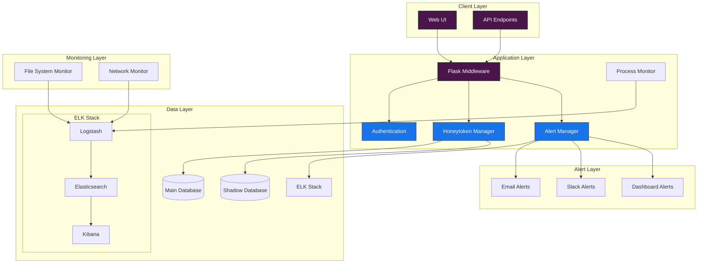
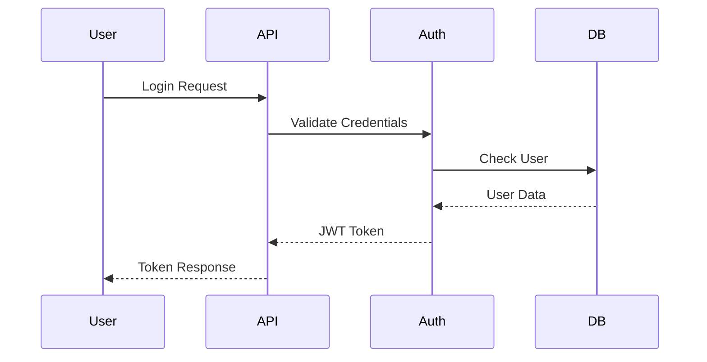
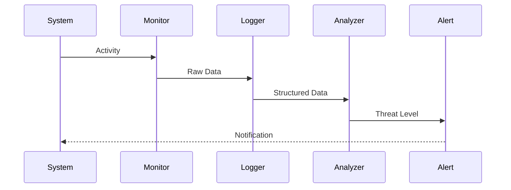
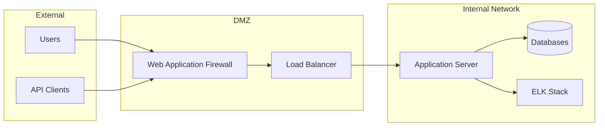
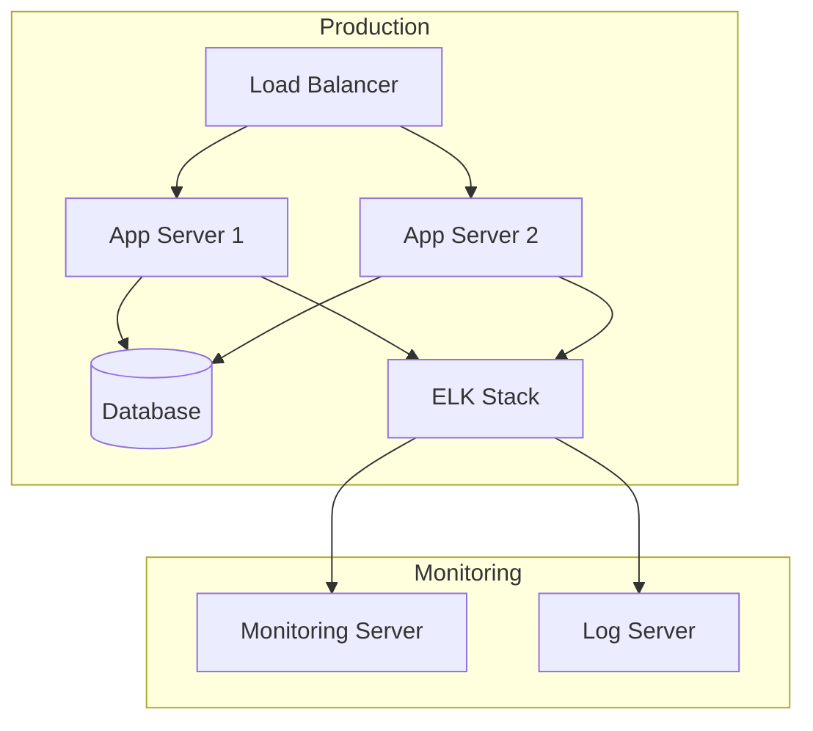

# System Architecture

## High-Level Architecture Diagram



## Component Details

### 1. Client Layer
- **Web UI**: Administrative interface for honeytoken management
- **API Endpoints**: RESTful API for system integration

### 2. Application Layer
- **Flask Middleware**: Request handling and routing
- **Authentication**: JWT-based access control
- **Honeytoken Manager**: Honeytoken lifecycle management
- **Alert Manager**: Alert generation and distribution
- **Process Monitor**: System process monitoring

### 3. Data Layer
- **Main Database**: Production database
- **Shadow Database**: Honeytoken storage
- **ELK Stack**:
  - Elasticsearch: Log storage and search
  - Logstash: Log processing and enrichment
  - Kibana: Visualization and analysis

### 4. Monitoring Layer
- **File System Monitor**: File access tracking
- **Network Monitor**: Connection tracking
- **Process Monitor**: Process activity monitoring

### 5. Alert Layer
- **Email Alerts**: SMTP-based notifications
- **Slack Alerts**: Webhook integration
- **Dashboard Alerts**: Real-time web interface

## Data Flow

1. **Honeytoken Access**:
   ```mermaid
   sequenceDiagram
       participant User
       participant System
       participant Monitor
       participant Logger
       participant Alert
       
       User->>System: Access Data
       System->>Monitor: Check Access
       Monitor->>Logger: Log Access
       Logger->>Alert: Evaluate Threat
       Alert-->>System: Notification
   ```

2. **Alert Generation**:
   ```mermaid
   sequenceDiagram
       participant Monitor
       participant Analyzer
       participant Alert
       participant Notification
       
       Monitor->>Analyzer: Access Data
       Analyzer->>Alert: Evaluate Threat
       Alert->>Notification: Generate Alert
       Notification-->>Alert: Confirmation
   ```

## Security Architecture

### 1. Authentication Flow


### 2. Monitoring Flow


## Network Architecture



## Deployment Architecture

